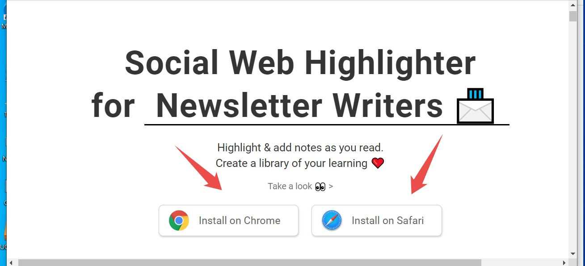
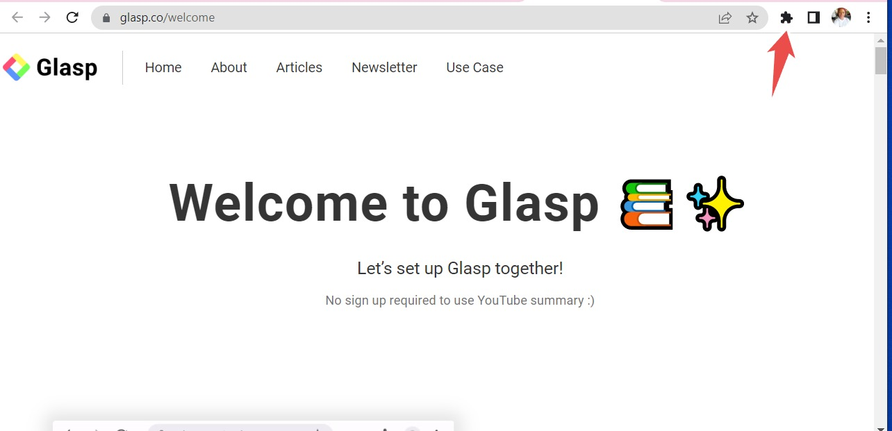
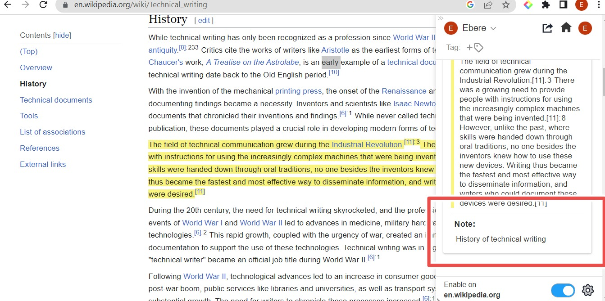
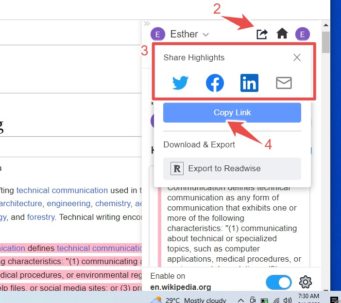
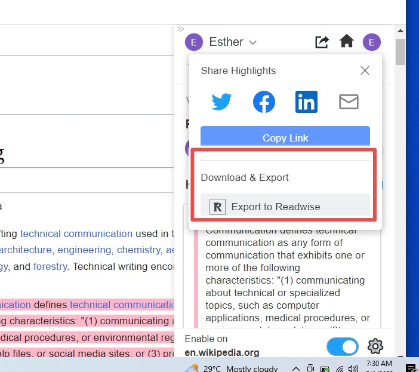
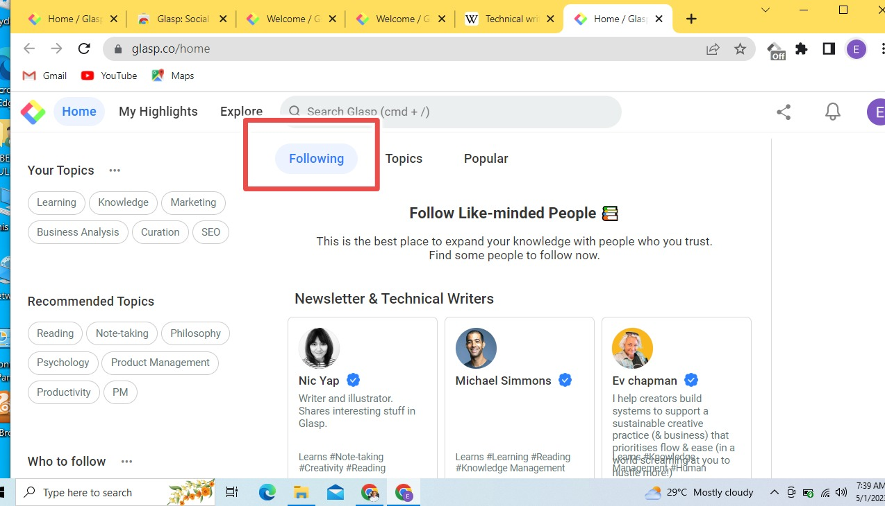
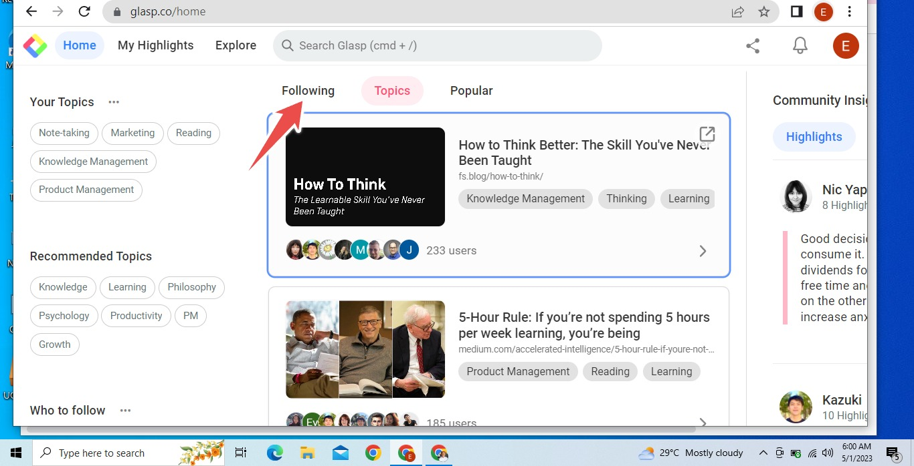
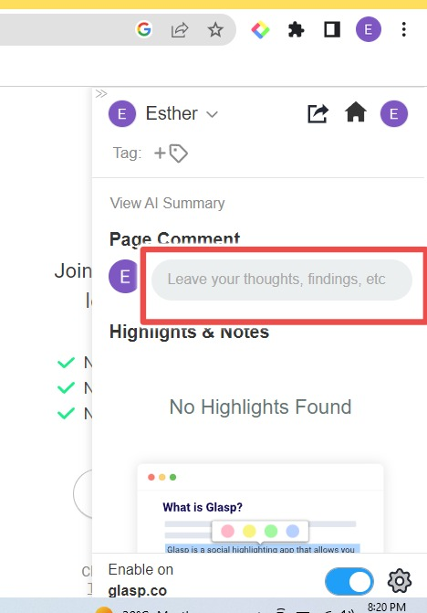

# **Glasp Social Web Highlighter: The Ultimate User Guide for Every Beginner**
## **Table of Contents**
- Introduction
- What is Glasp Social Web Highlighter and Note Taking 
- Why Should You Choose Glasp
- Installation of Glasp Highlighter
- Signing up for Glasp
- How to Use Glasp Extension
- Features of Glasp
- Glasp Alternatives
## **Introduction**
Leaving behind trails to go back is a very significant approach to keeping tabs on all your online readings. You might find it difficult to organize your web articles or you always lose track of the origin of your saved articles. It becomes even harder when you try to take important notes of them using a separate note-taking app. It doesn't always have to be this difficult.

**Glasp Highlighter** has provided outstanding features to make your readings easier and smoother.
 
This ultimate user guide takes you through the various steps to highlight your web content, take note of them and even save them. By the time you're done reading this article, you'll also learn how to highlight and take notes of YouTube video transcripts and even generate AI summaries of them.
## **What is Glasp Social Web Highlighter and Note Taking**
Glasp (Greatest Legacy Accumulated as Share Proof) is a great tool designed to take notes during web searches. It is also capable of making annotations of important sections of your internet materials while reading. This web highlighter helps you to automatically document significant points and information that will be useful to you and others in the future.

Glasp is built for both writers and readers. This is because you get to share important areas you have documented with others who have similar interests as you. As you read, highlight, and save online content, you form your repository of readings that others can tap into even when you are no more.
## **Why Should You Choose Glasp**
- ### **Reading Tracker**
With Glasp, you can easily track all the readings you have made on the internet. Clicking on any highlight that you have done takes you back to the web page where you got it from.
- ### **Content Pointer**
It serves as a pointer to other people during their searches. This is because, anybody who clicks on any highlighted online content with Glasp, is directed to the original web page of that highlight. That way, he gets to see the source and possibly get more insights.
- ### **A Personal Reading Repository**
Using Glasp to highlight and automatically save important content curates every single web content that you have annotated. This way, anybody that comes across your profile knows your past reading interests.
- ### **Access to the Global Community**
Using Glasp, you can share your highlighted web content on social media platforms like LinkedIn, Twitter, Facebook, etcetera.
- ### **Connector to People of Similar Interests**
Highlighting and curating significant parts of web content exposes you to the annotated significant web content of people of like minds. That way, you get to make connections if you so please. It also gives room for you to follow people and for people to follow you. This helps in your networking.
- ### **Personalization Features**
You can personalize your annotations by labeling the different colors of highlights that suit you. This way, you get to easily recognize the context behind any saved content.
## **Installation of Glasp Highlighter**
There are so many browsers that enable Glasp usage. Some of them are Brave, Safari, Opera, Edge, etcetera. However, for this article, we'll be using the Chrome browser for Desktop.

Glasp gets an Extension in the Google Chrome Desktop browsers and the App Store. Its mobile equivalent is not yet in existence but you can access your documented highlights on your mobile.

Moreover, If you choose to use other browsers, no difference exists aside from the browser name. This means that the steps are pretty much the same

It is free for whatever task you want to perform with it.

But to use it during web content readings, you need to install and pin it to your browser. In this case, it is Chrome.

**To install Glasp:**

1. Open your browser (eg. Google Chrome)
2. Type [glasp.co](https://glasp.co/) into the search bar 
3. This will take you to the Glasp page.
4. Click on install on Chrome (Safari if that's the browser you're using)

5. This will open a new page for you to add the extension to Chrome. Click on "add to Chrome" written against a blue background 

6. Confirm your actions by clicking on the Extensions that will pop up.

7. This will open their welcome page as a sign that you have successfully installed the Glasp extension on your Chrome (Safari) browser 

It is also important that you pin this extension to your browser for a smooth user experience.

To do this:

1. Tap on the Chrome extension menu icon at the top right corner of your browser 

2. From the drop-down menu, tap on the glasp icon
3. Then click on the pin icon against glasp

4. You have successfully pinned your glasp to your browser.

## **Signing up for Glasp**
For you to use the Glasp highlighter, you are expected to sign up for Glasp using your Gmail account. You can choose to log in if you already have an existing account.

To do this:

1. Tap on the Glasp icon that you pinned at the top right corner of your browser

2. Tap on Sign up (beta) written against a blue background 

3. Tap on "Continue with Google" to sign up for your Gmail account 

4. Open your Gmail account and confirm your account sign-up. Without doing this, you can't use the significant Glasp features.
5. This will lead you back to Chrome (Safari) web store

You can now successfully use the Glasp Extension for your browser.

## **Features of Glasp**
To make use of these Glasp features, it is believed that you must have signed up to Glasp on your desktop browser. If you haven't, please go back and follow our guide on steps to signing into Glasp. 

Some of the Glasp features that are to be discussed in this guide include:

- Web Content Highlighter
- Note Taking
- Share your Highlighted Contents
- Home Page
- My highlights
- View AI summary 
- Leave a comment about a web article
- Copy Highlighted Content and Notes to a note-taking app
- Highlight YouTube videos transcripts.

### **Web Content Highlighter**
This allows you to highlight important parts of web content for you to save and document them.

To do this:

1. Open the web content that you would want to highlight
2. Select the chunk of text by clicking and dragging on them
3. A color highlight menu options will be shown for you to choose your desired color 

4. Select any color of your choice and it will reflect against the chunk of texts. The highlighted text will mappear by the sidebar.

### **Note Taking**
Glasp makes it possible for you to input some notes into your Highlighted contents.

To do this:

1. Tap on the Glasp Extension icon to go to the sidebar
2. Hover your cursor over the highlighted texts
3. This will show up some features against the highlighted contents, tap on the "hand (pencil) icon" by the down left
4. You can write some notes to back up your highlighted texts
5. Click on enter to auto-save your notes.

### **Share your Highlighted Contents**
With this feature, you can share your highlights. This also enables you to download and export those highlighted web contents.

To do these:

1. Tap on the highlighted content
2. From the pop-up menu, tap on the share icon 
3. This will open a list of available places you can share with people
4. You can also choose to copy the link to the clipboard to paste it to a separate writing box 

### **To export downloaded highlights**
This means that you can export your annotated content into any of your note-taking apps. 
You can also download other people's highlighted content too. It also makes provisions for you to export images of your content also called Quoteshots.
  
- This can be done in a downloaded format or exported to Readwise.
- Tap on Export to Readwise and it is done.

###  **Home Page**
This takes you to the home page of Glasp where you can perform further tasks of 
- Choosing who to follow
- Choosing your favorite topics 
- Viewing your followers
- Seeing your highlights 
- Personalizing your Glasp user experience

To navigate to the home page 

1. Open the Glasp sidebar
2. Tap on the Home icon. 

#### **Following people and choosing followers**
1. Tap on the following button right before the topics 

2. This will bring up the bios of people that you can follow based on your topic interests.
3. Click on follow against each profile to add them to your following list. 

4. All the people you chose will be added to your newsfeed.

#### **Choosing your Topics**
This helps filter your newsfeed on the kinds of web content to show you on the home page.

To do this:

1. Click on your Topics
2. From the lists of search interests, choose as many topics as they concern you
3. Tap on select 

4. The lists of topics will be brought out for you.

### **My Highlights**
This is a feature that lets you in on all your highlights and notes. You can also view the statistics of your highlights which include how many people viewed them, how many articles you've highlighted so far as well as how many website pages you've highlighted.

To look through your highlights:

1. Go to the Glasp Home Page 
2. Click on my highlights 

.jpeg)

3. From there, you can view your highlights

### **View Ai Summary**
This is a Glasp feature that allows you to view an AI summary of your webpage where you highlighted your content. 

To generate this:
1. Click on the Glasp icon at the top right corner
2. Tap on "view Ai summary"
3. From there, you can check the Ai generated summary of the webpage of interest
4. There's a provision beside it where you can copy the summary or share them on Twitter.

### **Leave a comment about a web article**
In this feature, you can leave your thoughts, comments, findings, etc, following a web article of interest.

To do this:

1. Click on the Glasp icon at the top right corner of your browser
2. Tap on "leave your thoughts…"

3. Type in your comments, findings, afterthoughts, etc.

### **Copy Highlighted Content and Notes to a note-taking app**
This makes it possible for you to copy all saved Notes to either use them for your personal writing or share them with someone.

To do this:
1. Click on the Glasp icon at the top right corner of your browser
2. Click on "copy all" written against a blue background 

3. This will copy all the texts you have highlighted.

### **Highlight YouTube Video Transcripts**
This is a great feature of Glasp that enables you to highlight the transcripts of a YouTube video. It will also be saved and documented the same way as other Highlighted contents of web pages.

To do this:
1. Go to the Glasp home page
2. Click on the YouTube button at the top right corner of the Glasp Home page 

2. From the search bar, search for the video that you want to highlight
3. Tap against it to start streaming
4. On the right side, you will see the toolbar of the Glasp extension. Click on "Transcripts and Summary."
5. This automatically opens for you a transcript of the video of interest 
6. Using the same method of highlighting web content, select and highlight the content of importance 
7. You can choose to share this transcript with people 
8. It is also possible to get an AI summary of the video transcript by clicking on the AI icon.

**Key Takeaway**

Just like normal web content, 
- you can also leave a comment or thoughts on a video transcript. 
- You can copy the transcript to be shared with people
- And you can also get an AI summary of the transcript. 
- However, since this is a video, you can tap on an icon that will take you straight to the part of the transcript that is commensurate with the current area of the video. 
- You are also allowed to change the language of the video transcript.

## **Glasp Alternatives**

- ### **[Matter](https://hq.getmatter.com/web-extension)**
This is also a good highlighting tool for web content. It has a mobile equivalent of iOs devices, and also Extensions for Desktops. It has a Reader-view format. You can also annotate audio content with Matter Unlike Glasp which makes your content available to the world, Matter is more private. It is only made public if you decide to share it with some people. Moreover, it is limited to content on Twitter, websites, and newsletters.
- ### **[Weava](https://www.weavatools.com/)**
This is another highlighting and annotating software that lets you save and write notes on web articles. You can also use it to group your highlighted contents into folders and subsections. It is affiliated with the Chrome browser and used in organizing your research, especially for those in academia. However, it requires the premium version if you want to make your searches public. Otherwise, stick to the free version where you privately make use of your Highlighted texts.
- ### **[Liner](https://getliner.com/)**
This is another internet highlighting pen which helps you to organize your web reading experience. Liner is built to direct its users to the right web content based on their search history. Like Glasp and other highlighters, it has extensions on Chrome and other web browsers. And, unlike other web highlighters, it always updates itself just like its attachment to AI tools. It has a free and premium version. 
- ### **[Marker.Ink](https://marker.ink/)**
As Weava is exclusively for Chrome, marker. ink is native to Firefox. It highlights and enables note-taking of web content. It is high on privacy policy and has both a pen mode and mouse mode for you to customize your user experience.
- ### **[Diigo](https://www.diigo.com/)**
This is a tool that lets users bookmark, annotate and highlight their websites and web contents to save and organize them. One beautiful thing about Diigo is that it's available for both Android phones and iOS. It has a separate software that you can make use of if you don't feel like attaching it to a browser. However, it has limited features in its free version. This means that its premium package allows you access to all its features.

